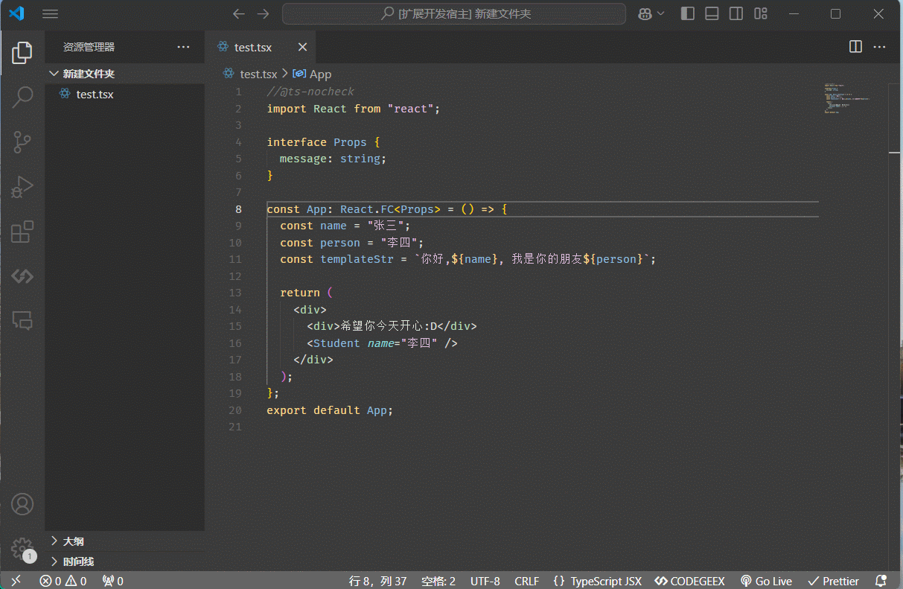

# 🌐 Auto-Translate Helper

## 📋 简介

**Auto-Translate Helper** 是一个用于 React 项目的 VS Code 插件，帮助你轻松实现项目的自动化国际化翻译。通过简单的设置和命令，让你的应用支持多语言，轻松面向全球用户！🌍✨

## 🚀 功能

- **自动国际化**：使用简单的命令自动将文本翻译成指定语言。
- **自定义配置**：可以配置需要的语言、存放语言包的目录及文件后缀。
- **便捷的命令调用**：在编辑器内右键选择 “自动国际化” 即可翻译选中的文本！💬

## 🌟 示例

## 🛠 安装步骤

1. **下载并安装**：可以从 VS Code 市场（待添加链接）直接安装，也可以下载 `.vsix` 文件手动安装。
2. **激活命令**：在编辑器内右键，选择 **自动国际化**。

## 📄 配置项

在 VS Code 设置中搜索 `auto-translate-helper` 进行配置：

| 配置项                                | 描述                    | 默认值          |
| ---------------------------------- | --------------------- | ------------ |
| `auto-translate-helper.languages`  | 需要翻译的语言列表             | ["zh", "en"] |
| `auto-translate-helper.localesDir` | 语言包存放的目录（相对于 src 的路径） | `locales`    |
| `auto-translate-helper.suffix`     | 语言包文件的后缀名             | `ts`         |

## 💻 脚本命令

插件包含以下 npm 脚本命令，助你更好地开发和测试：

- `test`：运行测试
- `compile`：使用 webpack 进行编译
- `watch`：监听文件变化并实时编译
- `lint`：代码规范检查

## 📜 使用依赖

此插件依赖多种库来实现功能，其中主要的有：

- `@babel` 系列：解析与生成代码
- `axios`：进行网络请求
- `nanoid` 和 `md5`：生成唯一标识和加密
- `html-loader`: 用于嵌入webview 

## 🧑‍💻 贡献

欢迎贡献代码，帮助完善此项目！提交 PR 或 issue 来分享你的建议。🌟

---

让你的 React 项目轻松支持多语言，开始使用 **Auto-Translate Helper** 吧！
